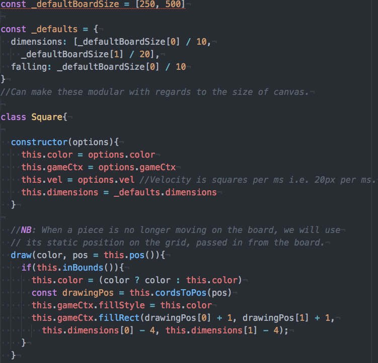
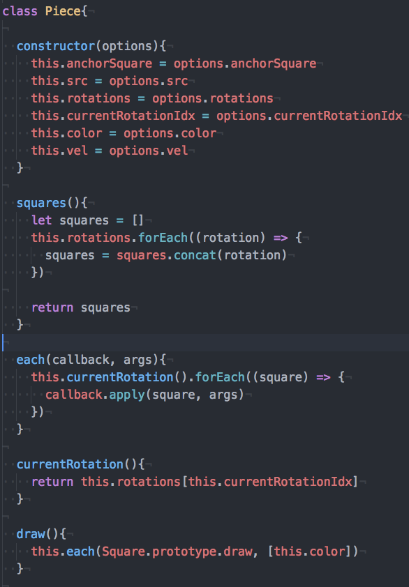
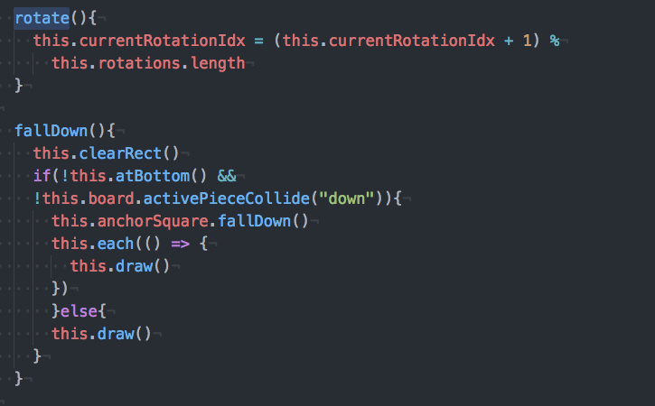
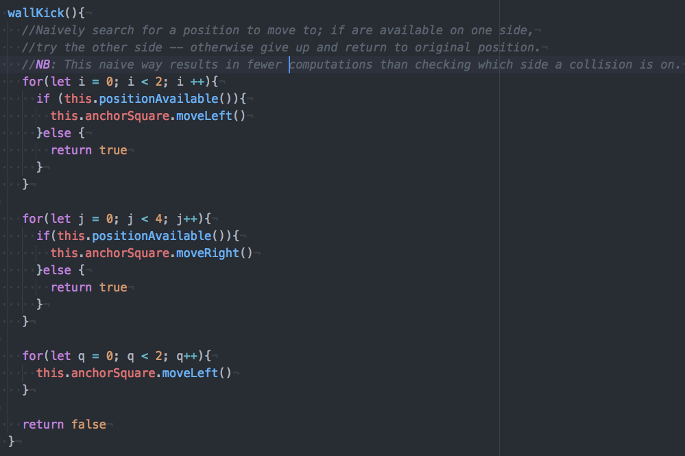

# README

## Overview
Tetris is a browser based game, coded completely in Javascript and HTML5.
  

## Instructions
-  Visit http://isaacseessel.com/Tetris/
-  Press enter to play.
-  Left/right arrow keys move the piece.
-  Up Key rotates the piece.
-  Press P to pause.
-  Press R to restart.
-  Press M to mute music.

## Features
- 7 different pieces with unique colors and rotations.
- Scores and levels for great game-play.
- Move, rotate, and speed up drop of pieces.
- Row clears upon being full.
- Ability to "kick" against the wall if the piece rotates too close.
- Special moves such as T-Spins.
- Delayed deactivation of pieces for optimal game-play.

## Code Highlights

### Strong object orientation Design allows for modular, extensible code.
  Through this light-weight Object Orientation design I can present my code cleanly. This approach  allows me to animate the entire piece as it falls down, as well as draw each individual square when it no longer animates.

  *square.js*
  

  *piece.js*
  

###
Use of anchor-squares and relative-squares for pieces allows for easy implementation of T-Spins and wall-kicks.
  Each Tetris piece keeps track of its rotations, which is represented as 2D array of squares, and its anchor square. Each relative square has its positions relative to its anchor square. In doing so, we are able to easily implement rotations, as well as complex moves, such as t-spins and wall-kicks.

  *piece.js*
  
  
